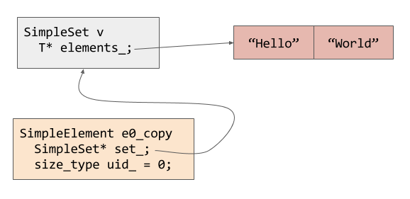

# CME 212 Notes

* 2016-01-08: Lecture 3

## Announcements

* HW0 posted, due next Friday
* GitHub usernames due by 5pm today
* Late policy: everybody gets one late submission.  Homeworks are due Fridays.
  Late deadline is Sunday at midnight.
* Office hours will posted soon on Piazza
* I uploaded a virtual box image that should work

## Agenda

* Introduce HW0
* Demo git commands
* Talk about the proxy pattern
* Pointers to C++ primer material

## The proxy pattern

Motivation:

* We often use data containers that store complex objects
* We want an efficient and convenient way to access the objects inside of a
  container
* *efficient*: fast access, avoid copying lots of data
* *convenient*: the access method should work as long as the object and
  container are available.  Should not depend on container implementation
  details.
  
"proxy" objects implement these ideas.

### `proxy_example.cpp`

Our starter code repo has an example of a simple container and proxy:

<https://github.com/CME212-Winter2016/CME212/blob/master/Examples/proxy_example.cpp>

Code has:

* `SimpleSet`: a very simple set-like container
* `SimpleSet::SimpleElement`: a proxy object to access elements of `SimpleSet`

Usage example from `main()`:

```c++
  // create the set
  SimpleSet v;
  // add some elements (push_back returns proxy)
  SimpleSet::SimpleElement e0 = v.push_back("Hello");
  SimpleSet::SimpleElement e1 = v.push_back("World");
  std::cerr << e0.text() << " " << e1.text() << std::endl;
  // prints "Hello World"

  // get_element returns a proxy
  SimpleSet::SimpleElement e0_copy = v.get_element(0);
```

Let's peek inside of `SimpleSet::SimpleElement`.  It stores a pointer to the
larger container and an index of the data item:

```
class SimpleSet
  class SimpleElement
   private:
    // Pointer back to the SimpleSet container
    SimpleSet* set_;
    // This element's unique identification number
    size_type uid_;
```

In diagram:



### Important C++ understanding

From C++ Primer:
<http://proquest.safaribooksonline.com/book/programming/cplusplus/9780133053043>

* Section 2.3: Compound Types (references and pointers)
* Section 2.4: `const` Qualifier
* Chapter 7: Classes

### Thoughts on references and pointers

C++ uses `*` and `&` for many different things.  It is very important to have
mental clarity for these things in your code.

In **type declarations**:
* `*` is used to declare pointers
* `&` is used to declare references

In code:
* `*` is the deference operator: returns value at a memory address
* `&` is the address-of operator: returns the address of a variable (pointer)
* Note: these are inverse operations

Note:
* `*` is also a binary operator for multiplication, but multiply has lower operator precedence
  than deference
* `&` is also a binary operator for bitwise AND, which has lower precedence than
  address-of

### Functions may return pointers and references

You must not return a pointer or a reference to objects with lifetime limited to
function execution.

```c++
int* my_bad_func() {
    int a = 10;
    return &a;
}
```

In the above example the data for `a` is cleaned up when `my_bad_func` exits.
Here is a valid pointer return example:

```c++
double* zeros(size_t n) {
    double* a = malloc(n*sizeof(double));
    if (a) {
        for (size_t i = 0; i != n; ++i) {
            a[i] == 0;
        }
    }
    return a;
}
```

Class members often return references to data items managed by the class.  For
example, my research code defines a specialized `Vector<T>` container.  It
defines `operator[]` to access data elements.  The prototype is:

```c++
template <typename T>
class Vector {
  // ...
  T& operator[](const int idx);
  // ...
}
```

Normal functions may also return a reference.  This is almost always returning a
reference that was passed into the function.  The stream output operator `<<` is
an example of this.  The code `std::cout << "hello";` actually calls
`operator<<(std::cout,"hello")`.  Chaining of `<<` is possible because
`operator<<` returns a reference to the first input argument.  It looks
something like this:

```c++
std::ostream& operator<<(std::ostream& s, const std::string& x) {
    // code to write x to the ostream s
    return s;
}
```

So now when you write:

```c++
std::cout << "nick" << "is awesome" << std::end;
```

C++ is doing:

```c++
operator<<(operator<<(operator<<(std::cout,"nick"),"is awesome"),std::endl);
```

and it all works out.
